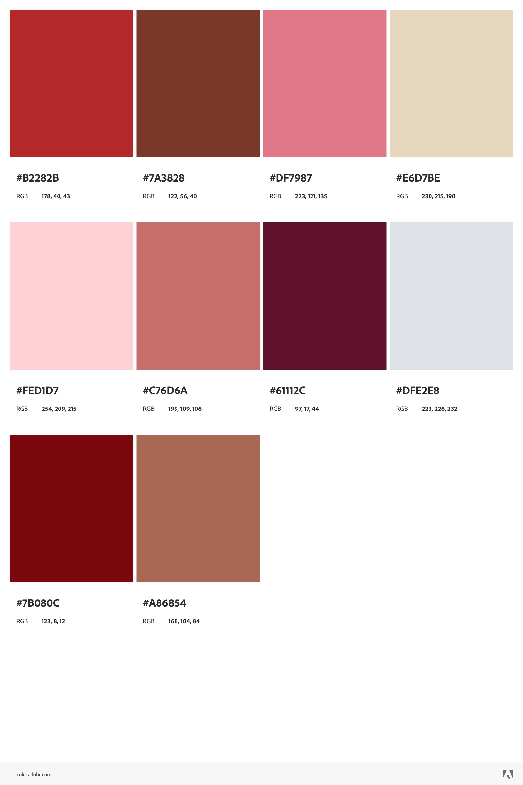

Grace Robinson
http://a1-gracerobinson.onrender.com

This project shows a page that showcases me. All of the css styling that I added allowed me to create a page that is unique to me. Some fun things in the page that make it even more personal are the background image in the header is actually a picture I took of the sunset at my home in Idaho. Also, all of the colors on the page are my favorite colors.

## Technical Achievements
- **Styled page with CSS**: Added rules for the header, body, h1, h2, h3, p, section, li, ul, ul li, button, button:hover, #showimage (this takes the hidden image and shows it), #hiddenimage (this takes the shown image and hides it), img, table, (th, td), tr, (tr, th, td), a, footer. The css styling that I added changed the color of the page and the color and looks of other tags. I made sure everything on the page was centered and every p and ul li tag had border and background color. The button I also made, with JavaScript attached, had special css to make the button round with background color and border. Also, every h1, h2, and h3 tag was given certain styling to give color and size to each one. I also styled the li and the ul lists to make it so that they would pop up in rounded squares side by side instead of with the actual bullet points. The JavaScript animation that I added was a button that when pressed opens up an image of myself and then there is also a button to close the image of myself. The additional semantic HTML tags that I used are links to show other websites for my favorite places, images to fill the header background and show an image of myself, a table to display my favorite things, a header to instroduce the site, and a footer to signify that the end of the page has been reached.

## Design Achievements
- **Used the Ubuntu Font from Google Fonts**: I used Ubuntu as the font for the primary text in my site. The color palette that I used can be seen in color_palette.jpeg below.

