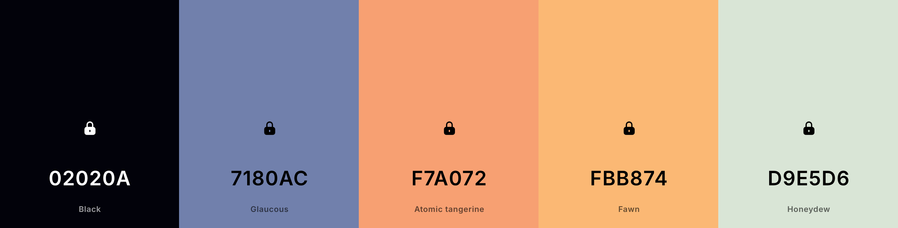

Assignment 1 - Hello World: Basic Deployment w/ Git, GitHub, Render
===

Jack Richard
https://a1-jackrichard.onrender.com

This project shows a basic site, created using plain HTML, CSS, and JS, that is pushed to GitHub and deployed on Render.

## Technical Achievements

- **Styled page with CSS**: Added rules for the body, a, section, h3, ul, li, and p selectors

- **Added a JavaScript animation**: Animated the entrance of my name to the screen

  _This was tricky at first, because I wanted to use requestAnimationFrame, but the animation was far too fast, so I
  switched to using timeouts at 100ms to animate the name in a way where it can be noticed._

- **Experimented with semantic tags**:
    - *table* was used to highlight my skill areas
    - *main* was used to identify the main content of the page
    - *section* was used to separate the site content into sections for screen readers
    - *a* was used to define external links on the site
    - *strong* is used to emphasize certain content on the site

## Design Achievements

- **Created a color palette from Coolors**: Created and implemented a color palette in the CSS styles of the site (image
  below)

  _It took some time to define a color palette that I liked with the options in the Adobe tool, so I switched to
  Coolors. I added white to the palette as well for the main card color. I used CSS variables to make the colors easy to
  reuse in the styles._

- **Used the League Spartan Font from Google Fonts**: I used League Spartan as the font for all text in my site

