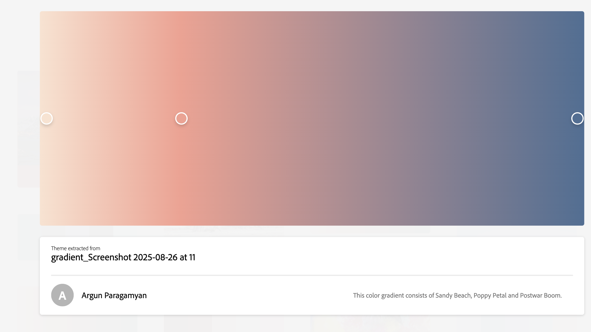

Assignment 1 - Hello World: Basic Deployment w/ Git, GitHub, Render
===

This project shows ...

## Technical Achievements
**Styled page with CSS**:
Rules: I added rules including a .experience-section, .rcorners1, body, h1, h2, .button, header, footer
1. Implemented box shadows to create a shadow on my expereince boxes
    - used this link to learn about it:  https://www.w3schools.com/css/css3_shadows_box.asp
2. Added a button and a button:hover that changes color when hovered over and when you click the button, the javascript animation will play
    - used this link to learn about it:  https://www.w3schools.com/css/css3_buttons.asp 
3. Added emojis using the hexadecimal values (ex. &#x1F338) and also pasting the emojis themselves into the file
    - used this link to learn about it:  https://www.w3schools.com/html/html_emojis.asp
4. Added rounded corners to my boxes using .rcorners to have my lists be in these boxes with customized padding, border radius, and display
5. Added a layout container with custom background color, height, width, and overflow: hidden

**Added simple JavaScript animation**:
    - (html) used this link to learn about it:  https://www.w3schools.com/js/js_htmldom_animate.asp
- used a container that acts like a stage, and an emoji element 
🍂
 inside it. The button calls myMove() when clicked.
- (css) used overflow: hidden so emoji only shows up when button clicked
- used position: absolute; so changing its top and left actually moves it
- the animation itself works with myMove that makes the emoji visible (display: block) with setInterval(...)
- on each tick of the timer, the position variable increases and style.top and style.left which slides the emoji diagonally.
- the emoji then goes off the container view and the animation ends
- **this animation was taken from the w3schools page to move something diagonally across the screen

**Experiemnted with HTML tags**:
    - used this link to learn about different css/html tags:  https://www.w3schools.com/html/html_css.asp 
Tags:
1. Added link to my resume using the href tag
2. Added header with my name and defined it in my style section
3. Added footer to end of page and definited it in my style section (header, footer {})
4. Added an image of me from IQP
5. Used the exisitng list and added a button feature

## Design Achievements
**Used the Montserrat Font from Google Fonts**: I used Montserrat as the font for the primary copy text in my site.
    - link to font:  https://fonts.google.com/specimen/Montserrat 

**Color Pallete**: All colors form the color pallete from color.adobe.com were used in my webpage.  I also took creative liberty and added my own colors that weren't explicitly inlcuded in the 3 colors from my chosen pallete.

## Design Achievements
**and how they were overcome**
- learning how all of the components work together since I am fairly new to CSS and HTML, it is interesting how multiple langagues are used in one file.  So definitely understanding the format of the file and how CSS, HTML, and JavaScript all fit together was a learning curve for me.
- another challenge I faced was how to animate something with JavaScript as I've never done that before, so learning how to make the actual function myMove() and how it's called with the onclick= command.  It was also cool to learn how the actual position of the image is changed within the frame() function using clearInterval
- another challenge I faced was just setting up my style {} space and how it corresponds to the code inside the body and hwo the rules are actually applied.  There's a lot of different parts all in one index file so it was challenging to piece it all together
- my last challenge was getting different paths to show up such as my image.  I had to add a case to the switch statement inside the server.js file

**AI Usage**
I used Chat GPT to explain concepts used in this assignment, but did not have it write any code for me.  AI specifically aided me in understanding how CSS / HTML tags work, the general format of the document, and helped me debug when my image was not showing up on my webpage.