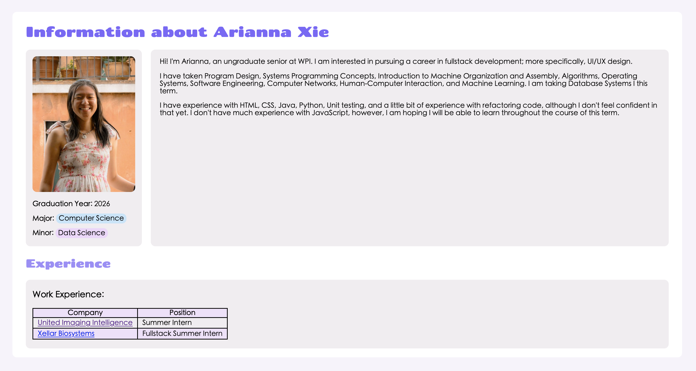
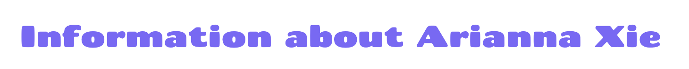
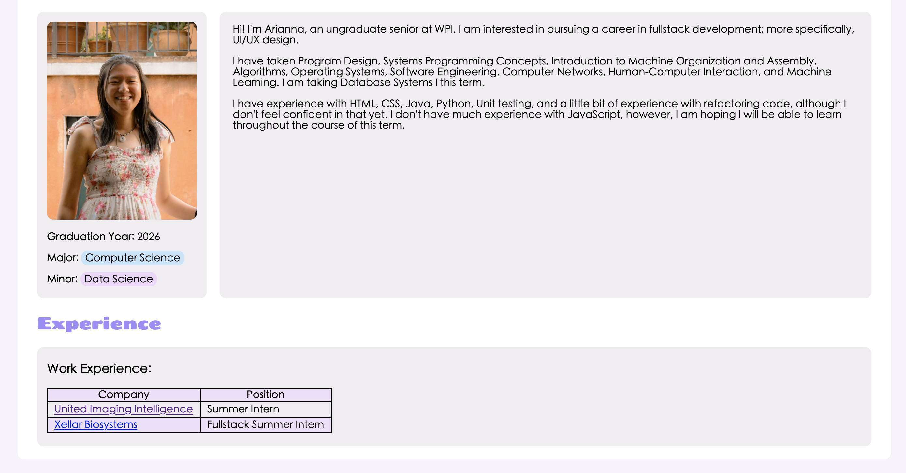
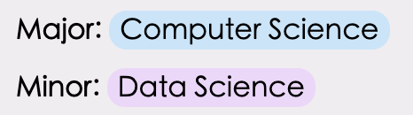
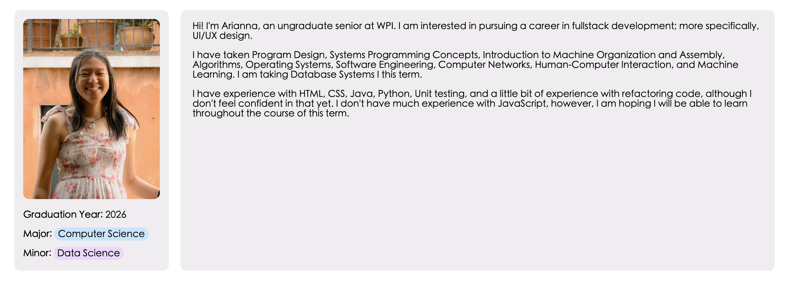
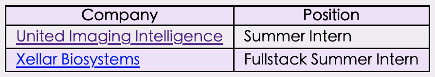
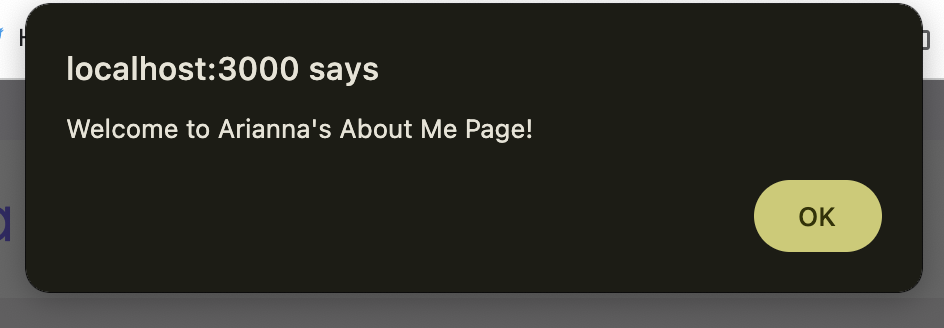
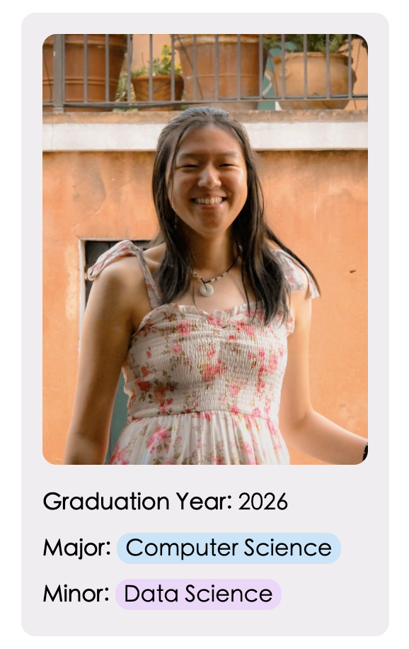
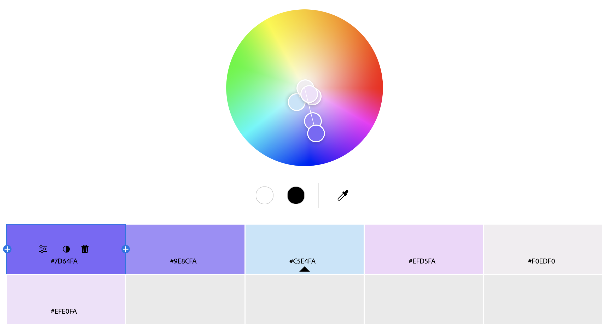

Arianna Xie
https://a1-ariannaxie.onrender.com/

This project shows ...

## Technical Achievements
- **Styled page with CSS**: 
1. I added rules for the h1 and h2 selectors to change the font and color. There was some of trial and error in this process to figure out what worked and what didn't.

2. I added rules for the body selector to change the font and margins. Again, there was a lot of trial and error in doing this.

3. I created custom selectors using id ('majorTag' and 'minorTag') and added rules to make major and minor "chips". Figuring out how I wanted to display them and figuring out how to translate that layout to code took a little bit of time.

4. I created custom selectors using class ('container,' 'label,' and 'info') and added flex rules to create columns. This was challenging in that I wasn't really sure how to create the columns at first, but through Google searching, I was able to figure it out.

5. I added rules for the table, th, td selectors to add color and borders. Similar to the step above, I used Google to help me figure out things like how to collapse the borders and how to color every other row.

6. I added a media query to the 'container' and 'tag' for responsive page resizing styling. I added this because I noticed the page format would get messed up when the page would become narrow, so I did some trial and error with media queries until I thought it looked okay.

- **Added JavaScript animation to the page**: I added an alert popup. This was pretty simple, although I did have to Google how to insert JavaScript into HTML.

- **Added Semantic Tags**:
1. I added 2 links that link to the websites of the companies I worked for. To do this, I had to look at an example of links in HTML to remind myself of how to include one.

2. I added 2 section tags for the main writing section and the Experience section.
3. I added 1 aside tag for my graduation year, major, and minor.
4. I added a table for my work experience. To do this, I had to Google the documentation for tables in HTML to remind myself of how they were implemented.

5. I added 1 main tag to identify the main section of my page.
6. I added an image of myself to the page. I had a lot of challenges with this, since I found my photo wasn't showing up. Through Stack Overflow, I was able to learn what I needed to include in my server.js file to send the image. I also used ChatGPT to help debug my sendImage function further. The line of code it gave me is indicated in my server.js file.

## Design Achievements
- **Used a custom color palette created from Color Adobe**: I created a purple/blue color palette and incorporated all the colors in my CSS. The part I found challenging about this was creating a cohesive color palette and figuring out how I wanted to color the page.

- **Used Fonts from Google Fonts**: 
1. I used the Chango font for the heading. I did have to Google an example on how to use Google Fonts in CSS to do this.

2. I used the Noto Sans font for my main section.

