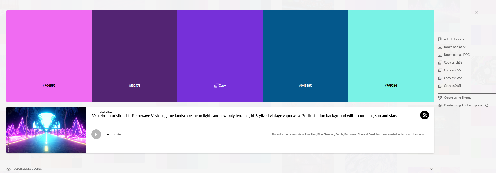

# CS4241 - Assignment 1 - Hello World (Wide Web)

**Utku Yakar**  
Live site: https://a1-utkuyakar.onrender.com/

This is my first assignment for the course. It’s a single `index.html` page served using the provided `server.js`. I added my own content, some styling, and a few small features and even easter eggs to get comfortable with Render.

---

## What’s on the page
- My name, majors, and class year
- A short about me section and a fun fact
- A list of past CS courses at WPI (shown in a table)
- Work experience
- Technologies and methods I’ve used, with my experience levels, only the technologies the assignment asked are listed + TS
- A small animated owl just to demonstrate JavaScript working

---

## Technical Achievements
- **Styled the page with multiple CSS rules.** I set up a centered layout with a max width, styled cards with round borders and colored accents, added varying row colors to the course table, created the little pill shaped labels for the skills list, and made links change color on hover (like you would find in an actual webpage). It was a bit tricky to balance all the styles so the page didn’t look too “busy” while still showing off different rules. I also admit my color palette wouldn't be everyone's favourite.
- **Added a simple JavaScript animation.** The owl emoji slides back and forth across a dashed track using `setInterval` and basic document object model (aka DOM) measurements. Getting the math right for the boundaries of the track (so the owl doesn’t overshoot) took some trial and error.
- **Used several semantic HTML tags beyond the basics.** In addition to `html`, `head`, and `body`, I used `header`, `main`, `section`, `footer`, `time`, `table`, `thead`, `tbody`, `tr`, `th`, and `td`. Using these tags made the structure much clearer and nicer and more accessible, though I had to double-check the right way to combine them so everything still rendered cleanly.

---

## Design Achievements
- **Added a custom Google Font.** I chose **Chivo**, which has a clean but slightly unconventional look, I vibe with it, and applied it to the whole page. The challenge was making sure the font loaded properly with a `<link>` tag and that it fell back gracefully to system fonts.
- **Created and applied a custom color palette from Adobe Color.** I picked a vaporwave-inspired palette and made sure to use all five colors in different parts of the site:
  - Magenta for the owl track border and link hover
  - Deep purple for the main heading and table header
  - Violet for subheadings and the header accent line
  - Teal for footer accents and link colors
  - Aqua for card border accents and alternating table rows  

  It took some tweaking to apply all the colors in a way that felt consistent without overwhelming the design.  
  A screenshot of the palette (**vaporwave-color-palette.png**) is included in the repo, shown here:  
  

---

## How to run locally
```bash
node server.js
# then open http://localhost:3000