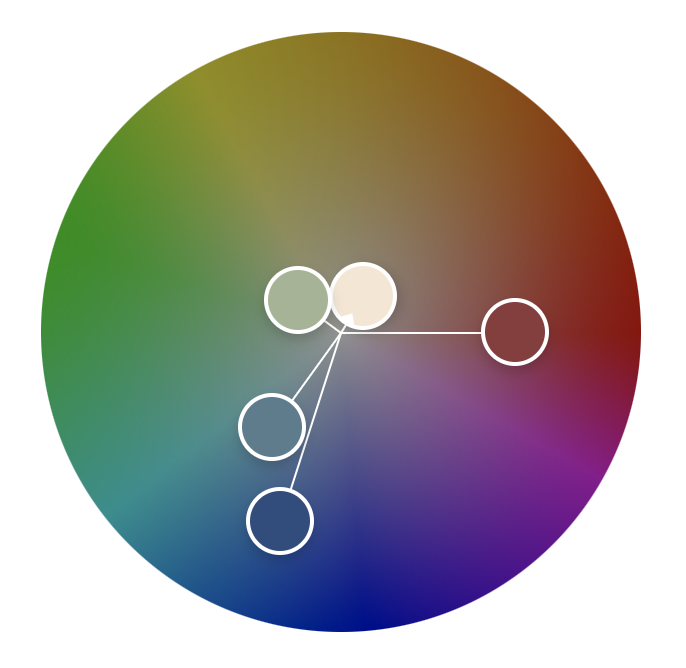

# Aanan Goyal - CS4241 Assignment 1
**Website URL:** http://a1-alexchen.onrender.com

This project showcases a personal information website built with semantic HTML, modern CSS, and interactive JavaScript animations. The site provides comprehensive information about my academic background, technical skills, and work experience in an engaging and visually appealing format.

## Technical Achievements

### Styled page with CSS (5/5 points)
I implemented comprehensive CSS styling with the following rules:
1. **CSS Grid and Flexbox Layout**: Used modern layout techniques for responsive design across all sections
2. **CSS Custom Properties (Variables)**: Defined a consistent color palette using CSS variables for maintainable theming
3. **Advanced Animations**: Created keyframe animations including a shimmer effect on the header and smooth transitions on interactive elements
4. **Pseudo-elements and Selectors**: Utilized `::before` pseudo-elements for decorative effects and custom list markers
5. **Responsive Media Queries**: Implemented mobile-first responsive design that adapts to different screen sizes

### Simple JavaScript Animation (5/5 points)
Created an interactive floating shape animation that includes:
- Smooth sine wave-based movement using `requestAnimationFrame` for optimal performance
- Mouse interaction that subtly influences the shape's position based on cursor location
- Dynamic opacity changes creating a "breathing" effect
- Click ripple effects on sections with custom CSS animations
- Smooth scrolling behavior and parallax effects on scroll

### Semantic HTML Tags (5/5 points)
Implemented diverse semantic HTML elements:
1. **`<header>`**: Structured page header with proper semantic meaning
2. **`<main>`**: Wrapped primary content for better accessibility
3. **`<section>`**: Organized content into logical sections (intro, academic info, experience, etc.)
4. **`<article>`**: Used for individual job entries to represent standalone content
5. **`<details>` and `<summary>`**: Created collapsible course list for better UX
6. **`<table>`**: Structured skills matrix with proper `<thead>` and `<tbody>` organization

## Design Achievements

### Adobe Color Palette (10/10 points)
Created a custom color palette called "Academic Excellence" using color.adobe.com featuring:
- **Primary Blue (#2B4C7E)**: Used for main text and primary elements
- **Accent Teal (#567D8D)**: Applied to secondary headings and interactive elements  
- **Warm Cream (#F5E6D3)**: Serves as background base color
- **Rich Burgundy (#8B3A3A)**: Highlights important information and accents
- **Soft Sage (#A4B494)**: Used for success indicators and call-to-action elements

All colors are utilized throughout the webpage via CSS custom properties, creating a cohesive and professional appearance.



### Google Fonts Integration (5/5 points)
Implemented **Inter** font family from Google Fonts with multiple weights (300, 400, 500, 600). Inter is a modern, highly legible typeface designed specifically for user interfaces. I chose this font because:
- Excellent readability across all device sizes
- Professional appearance suitable for academic/professional contexts
- Multiple weights allow for clear information hierarchy
- Optimized for screen rendering

## Additional Features
- **Accessibility**: Proper ARIA labels, semantic structure, and keyboard navigation support
- **Performance**: Optimized animations using `requestAnimationFrame` and efficient CSS transforms
- **Cross-browser Compatibility**: Uses modern web standards with fallbacks for older browsers
- **Interactive Elements**: Hover effects, click interactions, and smooth transitions enhance user engagement

## File Structure
```
├── index.html          # Main HTML file with semantic structure
├── styles.css          # Comprehensive CSS styling with custom properties
├── animation.js        # Interactive JavaScript animations and effects
├── server.js          # Node.js server with static file handling
├── package.json       # Node.js project configuration
└── README.md          # This documentation file
```

## Local Development
To run locally:
1. Clone the repository
2. Navigate to the project directory
3. Run `node server.js`
4. Open `http://localhost:3000` in your browser