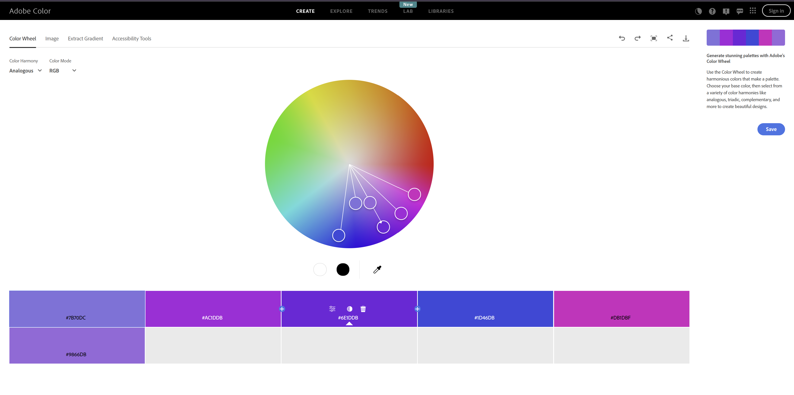

Shawn Patel
http://a1-shawnpatel.Render.com

This project shows ...

## Technical Achievements
### Styling
- h1 heading → Blue text **color** (#1D46DB).
- Paragraph right after h1 → Purple **border** (line around element), **padding** (space between element and its border), and **left margin** (space between other elements and border).
- Specific paragraph after audio → Larger purple text (#6E1DDB) at 160% using **font-size**.
- Next paragraph after that → Custom font (Playwrite CA), larger size (180%), and lighter purple color (#9866DB).
- Image -> **Border-radius** (rounds corner of the image) and **box-shadow** (adds a shadow around the element's box)
- More repeated CSS styles along with more than the 5 required (I listed some of the ones I used for credit).
### Javascript Animation
- I added a simple animation of a wheel spinning at the bottom of the webpage.
### Semantic HTML Tags
- Audio (audio)-> I added audio of Never Gonna Give You Up by Rick Astley.
- Image (img)-> I added an image of the Green Bay Packers.
- Table (table)-> I added a table with CS courses I have taken including the course number and course title.
- Form (form)-> I added a form where you can select what type of car I have.
- Unordered List (ul)-> I added a list for my working and technical experience(as required).

## Design Achievements
- **Used the Playwrite CA Font from Google Fonts**: I used Playwrite CA as the font for the p tag "Previous CS Courses Taken at WPI:".
- 
- I used all the colors from the pallete: #1D46DB, #7B70DC, #6E1DDB, #9866DB, #AC1DDB, and #DB1DBF.
