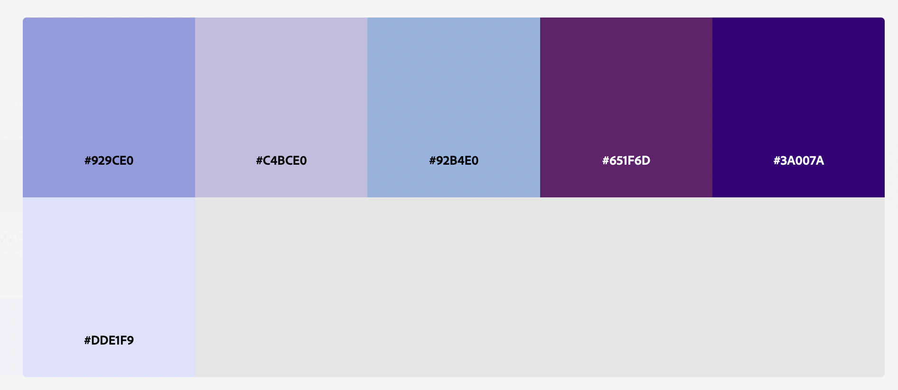

Isabel Cruz Rivera Site
===
Isabel Cruz Rivera Render site: https://a1-isabelcruzrivera-a25.onrender.com/

This project is a small personal website that fulfills all of the requirements outlined within the project.

## Additional CSS
In this project, I used a variety of different CSS rules to styles my site. Here is an example of five:
1. **text-align**: I used text align to center my text on the webpage
2. **background-color:** I set the background color of different sections, as well as the entire site
3. **color**: I used color to change the color of specific text.
4. **margin**: I used margin to edit the size of the margins besides elements.
5. **padding**: I used padding to add padding around my images and text, especially to make boxes around things bigger.

## Simple JS Animation
As part of my animation, I decided to make it so that my banner inverts colors when clicked. I made an alternate state that it would flip to when clicked, and the cursor of the mouse also changes when hovering over the element.

## Semantic HTML Tags
In this project, I used a variety of semantic HTML tags. Here is an example of five:
1. **figure**: I used figure around my photos.
2. **figcaption**: I used figcaption to caption my images.
3. **section**: I used section to house the different sections within my website.
4. **header**: I used header to house the information regarding the header to my site.
5. **image**: I used image as part of my site to have different photos.

## Color Palette
As part of my website, I used the following color palette:

## Google Fonts
I used one google font as a part of the header. The font I used was _Libertinus Keyboard_.

## AI Disclosure
As a part of this assignment, I used AI to assist me in adding images to the server.js file. Additionally, I used it to help me in debugging my JS animation.
