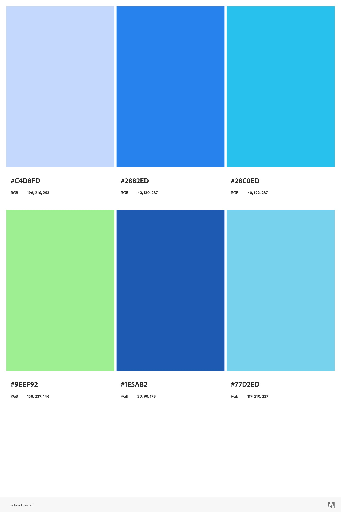

# Eric Li

Deployed site: https://a1-ericli-1.onrender.com/

## Technical Achievements
- **Styled page with CSS**: 
	- Used a custom color palette with CSS variables (`:root { --color-1 ... --color-6 }`) for easy management.
	- Applied a linear gradient background to the body
	- Added responsive padding to body as to separate content from the browser edges.
    - Used Funnel Sans font throughout the body.
	- Styled headings (`h1`, `h2`) with color 2.
	- Styled the navigation bar with background, rounded corners, and shadow, using color variables.
	- Styled navigation on hover with hover color transitions.
	- Styled tables with alternating row colors, rounded corners, and box-shadow.
	- Styled the footer with background and color variables for a consistent look using color 3.
	- Fade-in animation to all body content elements on page load.

- **JavaScript Animation**:
	- Added a button that, when clicked, displays a random funny animal image below it using JavaScript. [First script in index.html]
	- Added a script that applies a fade-in effect to all main content elements (headings, sections, etc.) when DOM loads. [Second script block in index.html]

## Design Achievements
- **Used a six-color custom palette using Adobe Color**

```
:root {
    --color-1: #c4d8fd;
    --color-2: #2882ed;
    --color-3: #28c0ed;
    --color-4: #9eef92;
    --color-5: #1e5ab2;
    --color-6: #77d2ed;
}
```



- **Used the Funnel Sans Font from Google Fonts**: The primary font for the site is Funnel Sans, loaded via Google Fonts.

- **Experimented with Semantic HTML Tags**:
	- `<header>`: Used to wrap the navigation bar at the top of the page.
    - `<main>`: Used to denote most important part of body.
	- `<nav>`: Contains navigation links for easy site navigation.
	- ``: Used for displaying a circular profile image in the About section and for displaying random funny images.
	- `<table>`: Used to display coursework and technologies learned/used in a visually pleasing format.
	- `<footer>`: Contains copyright info at the bottom of the page.
    - `<details>`: Used for diplaying a dropdown about my experience as a Tutor for Kumon
    - `<summary>`: Used for writing a witty comment about my experience as a Tutor for Kumon
	- `<a>`: Used for navigation and external links.
	- `<ul>` and `<li>`: Used for listing work experience.
	- `<h1>`, `<h2>`, `<p>`: Used for semantic structure and accessibility.
